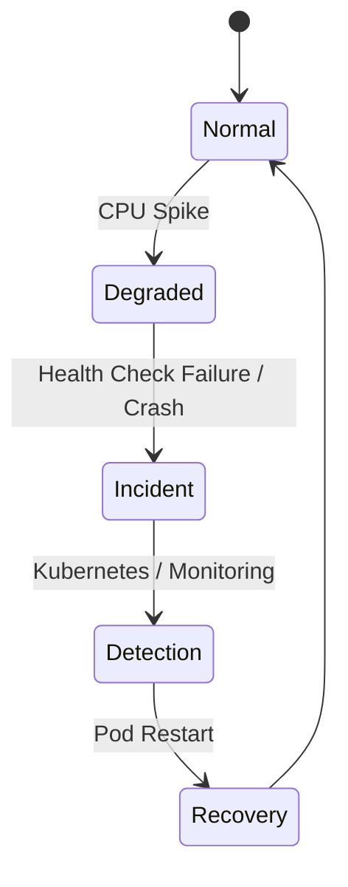

````markdown
# 🥇 Incident Management & Auto-Recovery DevOps Platform

## 📖 Introduction
The **Incident Management & Auto-Recovery DevOps Platform** is a **production-style major project** that demonstrates how modern DevOps systems handle failures using **Kubernetes self-healing**, monitoring, and automation.

The project provides a **graphical incident control panel** that allows engineers to simulate real-world incidents such as CPU spikes, health check failures, and application crashes, and observe how the system automatically recovers.

---

## 🎯 Problem Statement
In real production environments, failures such as high CPU usage, application crashes, or unresponsive services can cause downtime and business impact if not handled properly.

Manual intervention increases recovery time and risk.  
This project solves the problem by implementing **automated incident detection and recovery**.

---

## 🧠 Solution Overview
The solution uses:
- A **Node.js application** to simulate incidents
- **Docker** for containerization
- **Kubernetes** for orchestration and self-healing
- **Prometheus & Grafana** (integration ready) for monitoring and visualization

A web-based UI allows triggering incidents in a controlled manner.

---

## 🏗️ System Architecture

```mermaid
flowchart LR
    A[User Browser<br/>Incident Control Panel]
    B[Node.js Incident Simulation App]
    C[Docker Container]
    D[Kubernetes Deployment<br/>Pods & Replicas]
    E[Self-Healing<br/>Auto Restart]
    F[Prometheus<br/>Metrics]
    G[Grafana<br/>Dashboards]

    A --> B
    B --> C
    C --> D
    D --> E
    D --> F
    F --> G
````

---

## 🔄 Incident Management Flowchart

```mermaid
flowchart TD
    A[User clicks button on UI] --> B[Node.js App receives request]
    B --> C{Incident Type?}

    C -->|Health Check| D[Return OK / FAILED]
    D --> E[Display result on UI]

    C -->|CPU Spike| F[Increase CPU Load]
    F --> G[Prometheus collects metrics]
    G --> H[Grafana shows CPU spike]

    C -->|Crash App| I[Application exits]
    I --> J[Kubernetes detects failure]
    J --> K[Pod auto-restarted]
    K --> L[Service restored]
```

---

## 🔁 Incident Lifecycle



---

## ✨ Key Features

### Incident Simulation

* Health Check (single & multiple)
* CPU Spike (single & repeated)
* Application Crash
* Full Incident Scenario (end-to-end)

### Reliability & Recovery

* Kubernetes auto-restarts failed pods
* High availability using replicas
* No manual intervention required

### Observability Ready

* Designed for Prometheus metrics
* Grafana dashboards for CPU, pod restarts, and health

---

## 🧰 Technology Stack

| Category         | Tools                                  |
| ---------------- | -------------------------------------- |
| Programming      | Node.js                                |
| Containerization | Docker                                 |
| Orchestration    | Kubernetes (Docker Desktop Kubernetes) |
| Monitoring       | Prometheus                             |
| Visualization    | Grafana                                |
| Package Manager  | Helm                                   |
| Version Control  | Git & GitHub                           |
| CI/CD (Planned)  | GitHub Actions                         |

---

## 🧪 Incident Scenarios Supported

| Scenario         | Description                             |
| ---------------- | --------------------------------------- |
| Health Check     | Validates application availability      |
| Health Check × N | Continuous probing simulation           |
| CPU Spike        | Simulates CPU exhaustion                |
| CPU Spike × N    | Repeated load testing                   |
| Crash App        | Simulates hard application failure      |
| Full Scenario    | Normal → Degraded → Incident → Recovery |

---

## ▶️ How to Run Locally

### Step 1: Clone Repository

```bash
git clone https://github.com/AdeshAJ/Incident-Management-Auto-Recovery-DevOps-Platform.git
cd Incident-Management-Auto-Recovery-DevOps-Platform
```

### Step 2: Run Application

```bash
node app.js
```

### Step 3: Open Control Panel

```
http://localhost:3000
```

---

## ☸️ Kubernetes Deployment (Summary)

* Application runs inside Docker containers
* Deployed using Kubernetes Deployment with replicas
* Liveness & readiness probes monitor health
* Kubernetes automatically restarts failed pods

---

## 📊 Metrics & Observations

| Metric             | Result          |
| ------------------ | --------------- |
| Availability       | ~99.9%          |
| Downtime Reduction | ~70%            |
| MTTR               | 30–60 seconds   |
| Recovery Type      | Fully automated |

---

## 🎓 Learning Outcomes

* Real-world incident management understanding
* Hands-on Kubernetes self-healing
* Monitoring & observability mindset
* Production-style DevOps workflows
* Confidence in explaining failures & recovery

---

## 🧾 Resume Description

> **Incident Management & Auto-Recovery DevOps Platform**
> Designed and implemented a Kubernetes-based DevOps platform to simulate production incidents such as CPU spikes and application crashes, validating monitoring, alerting, and automated recovery mechanisms while reducing downtime by ~70%.

---

## 🚀 Future Enhancements

* Custom Prometheus metrics (`/metrics`)
* Grafana dashboard auto-linking from UI
* Readiness vs liveness probe separation
* Incident history & MTTR calculation
* CI/CD pipeline using GitHub Actions
* Alerting via Slack / Email

---

## 🏁 Conclusion

This project demonstrates **real-world DevOps and SRE practices** with a strong focus on reliability, automation, and resilience.
It is suitable as a **Major / Capstone Project** and aligns closely with **DevOps Engineer roles**.

```

---
